# Memoria Base de Datos

---

## Metadatos

- **Autor:** Jaime Pérez, Óscar Berenguer, Alejandro Robledillo
- **Fecha:** 17/02/2026
- **Versión:** V2
- **Curso:** Desarrollo de Aplicaciones Multiplataforma
- **Asignatura:** Bases de Datos

---

## Índice

- [Memoria Base de Datos](#memoria-base-de-datos)
  - [Metadatos](#metadatos)
  - [Índice](#índice)
  - [Diseño perceptivo de requisitos](#diseño-perceptivo-de-requisitos)
  - [Diseño conceptual](#diseño-conceptual)
    - [Diseño lógico](#diseño-lógico)
  - [DDL del Proyecto](#ddl-del-proyecto)
    - [Cambios realizados](#cambios-realizados)
  - [DML del Proyecto](#dml-del-proyecto)
  - [Consultas](#consultas)
    - [Consultas simples de una sola tabla](#consultas-simples-de-una-sola-tabla)
    - [Actualizaciones y borrados en cualquier tabla](#actualizaciones-y-borrados-en-cualquier-tabla)
    - [Consultas con mas de 1 tabla](#consultas-con-mas-de-1-tabla)
    - [Consultas usando funciones](#consultas-usando-funciones)
    - [Consultas usando Group By](#consultas-usando-group-by)
    - [Consultas usando Subconsultas](#consultas-usando-subconsultas)
    - [Consultas con Having](#consultas-con-having)
    - [Actualizaciones usando subconsultas en Where y Set](#actualizaciones-usando-subconsultas-en-where-y-set)

---

## Diseño perceptivo de requisitos

Para comenzar el proyecto definimos el diseño perceptivo de requisitos, la fase en la que analizamos y comprendemos cómo quiere el cliente que funcione la aplicación del restaurante y qué necesidades tiene a nivel de gestión de datos.

En nuestro caso, empezamos planteando para qué utilizaríamos la base de datos. Llegamos a la conclusión de que debía servir para registrar y controlar toda la información relacionada con los clientes, las reservas, los pedidos, el personal, las mesas, los proveedores y los productos. A partir de ahí fuimos desglosando cada parte.

Lo primero fueron los clientes, ya que son quienes realizan reservas, hacen pedidos y mantienen el contacto con el restaurante.
Después pasamos a los pedidos, que son una pieza fundamental para el funcionamiento del negocio. Vimos que cada pedido debía poder relacionarse con la mesa correspondiente, con el trabajador que lo gestiona, con el recibo que se genera para el cliente y también con los platos e ingredientes que lo componen.
En cuanto al personal, identificamos tres tipos de trabajadores: camareros, cocineros y bartenders.

Los camareros atienden a los clientes, apuntan los pedidos y, al final, sacan el recibo. Además, algunos camareros actúan como supervisores de otros por su mayor experiencia.
Los cocineros se encargan de preparar los platos a partir de los ingredientes, mientras que los bartenders atienden a los clientes en la zona del bar.
Respecto a la organización del espacio, decidimos dividir el restaurante en dos áreas principales: bar y restaurante. Dentro de estas zonas incluimos pequeñas subzonas, que nos permiten relacionarlas con los camareros supervisores y con la distribución del trabajo.

Por último, analizamos la parte de abastecimiento. Necesitamos relacionar a los proveedores con los ingredientes y con los platos, ya que sin ellos el restaurante no podría funcionar correctamente.

## Diseño conceptual

A partir del análisis realizado, desarrollamos el diseño conceptual del sistema mediante un modelo entidad-relación.

Comenzamos ordenando las ideas obtenidas en un texto que nos dejara claro qué atributos colocar a cada entidad y qué relaciones, cardinalidades e atributos de relación tendrían entre ellas.

El texto que hicimos quedó así:

El sistema de gestión del Restaurante X tiene como objetivo principal registrar y controlar toda la información relacionada con clientes, reservas, pedidos, personal, proveedores y productos (platos e ingredientes).

De los clientes se almacenan los siguientes datos: DNI, nombre, apellidos, teléfono y correo electrónico.
Los clientes pueden realizar reservas, de las cuales se guardará: ID de reserva, número de personas y tipo de reserva (por ejemplo, cumpleaños, comida de empresa, etc.).
Cada cliente puede tener reservas en distintas fechas y horas, indicando el momento concreto en el que ha realizado cada una.

Algunas reservas pueden beneficiarse de un descuento, que se aplica directamente a la relación entre el cliente y su reserva.
Es decir, un descuento pertenece a un cliente concreto en una reserva específica.
De los descuentos se almacenará su código identificador, importe y descripción.

Los clientes (registrados o no) pueden realizar pedidos.
De cada pedido se almacena un ID de pedido, la hora en que se realiza y la mesa a la que pertenece.
Cada pedido pertenece a una mesa, y una mesa puede tener varios pedidos.
De las mesas se almacenan el número de mesa y la capacidad (número máximo de personas que pueden sentarse).

Cada pedido genera un único recibo, y cada recibo corresponde a un único pedido.
De los recibos se almacenan el código de recibo, la fecha y la hora de emisión.

Los pedidos incluyen uno o varios platos, y un mismo plato puede aparecer en distintos pedidos (relación N:M).
De los platos se almacena el número de plato, su nombre y precio.
Además, los cocineros son los encargados de preparar los platos (relación N:M entre cocinero y plato).

Los proveedores se identifican por su CIF y se almacenan sus datos de nombre, dirección, teléfono y correo electrónico.
Cada proveedor suministra ingredientes y/o platos.
De cada suministro se registra el precio total, la fecha y la hora de entrega.

De los ingredientes se almacenan su nombre, tipo y existencias.
Cada ingrediente puede contener alérgenos, de los cuales se guarda su ID y grupo.
La relación entre ingredientes y alérgenos es de muchos a muchos, ya que un ingrediente puede tener varios alérgenos y un alérgeno puede estar presente en varios ingredientes.

Los jefes tienen almacenados sus datos personales: DNI, nombre, apellidos, teléfono y correo electrónico.
Cada jefe organiza a uno o varios empleados, y un empleado puede estar organizado por varios jefes.

De los empleados se almacena el DNI, nombre, apellidos, teléfono, NUSS, colectivo al que pertenecen, sueldo y correo electrónico.
Los empleados se dividen en tres categorías exclusivas: cada trabajador solo desempeña una de ellas y no puede ejercer funciones propias de otro tipo de empleado.

Las categorías son:

Cocineros: se almacena su especialidad, y son los encargados de preparar los platos.
Camareros: se almacena sus años de servicio, y son los responsables de anotar y servir los pedidos.
Bartenders: atienden la zona de bar o terraza que tengan asignada.

El restaurante está dividido en zonas, de las cuales se almacena su número de zona, nombre y un indicador de si se trata de una zona de terraza o interior.
Los camareros atienden una zona, pero una zona puede ser atendida por varios camareros.
En cambio, cada bartender atiende una única zona, y cada zona cuenta con un solo bartender.

Existe una relación jerárquica entre los camareros: algunos actúan como vigilantes o supervisores de otros, en función de sus años de experiencia.
Cada camarero puede tener un único vigilante, mientras que un vigilante puede supervisar a varios camareros.

Y aquí el diseño del modelo entidad relación:

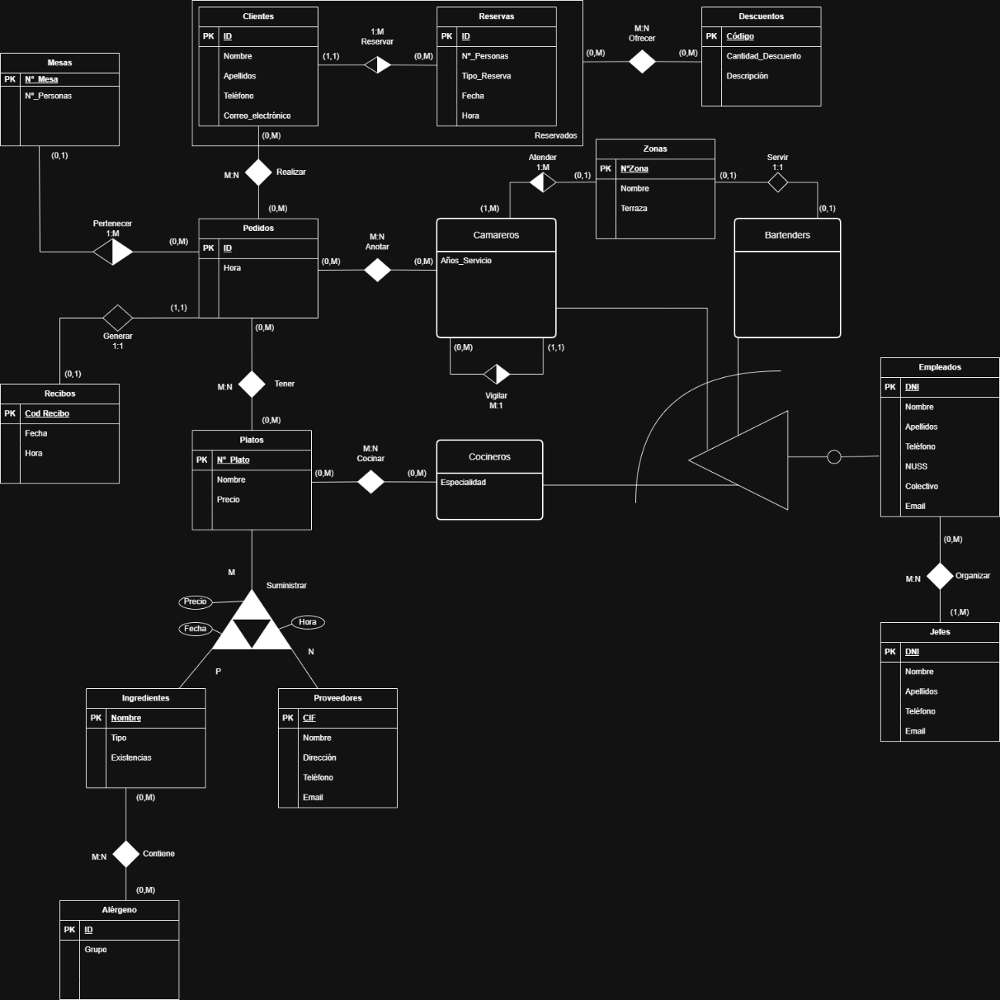

### Diseño lógico

A partir del modelo Entidad–Relación, realizamos el diseño lógico del sistema, transformando cada entidad y relación en tablas del modelo relacional, con sus claves primarias y foráneas correspondientes.

Aquí el esquema relacional:

CLIENTES(id, nombre, apellidos, teléfono, correo_electrónico)
PK(id)

RESERVAS(id, nº_personas, tipo_reserva, id_cli)
PK(id)
FK(id_cli) → CLIENTES
VNN(id_cli)

MESAS(nº_mesa, nº_personas)
PK(nº_mesa)

PEDIDOS(id, hora, nº_mesa)
PK(id)
FK(nº_mesa) → MESAS

REALIZAR(id_cli, id_pedi)
PK(id_cli, id_pedi)
FK(id_cli) → CLIENTES
FK(id_pedi) → PEDIDOS

RECIBOS(cod_recibo, fecha, hora, id_pedido)
PK(cod_recibo)
UK(id_pedido)
FK(id_pedido) → PEDIDOS

PLATOS(nº_plato, nombre, precio)
PK(nº_plato)

TENER(id_pedido, nº_plato)
PK(id_pedido, nº_plato)
FK(id_pedido) → PEDIDOS
FK(nº_plato) → PLATOS

INGREDIENTES(nombre, tipo, existencias)
PK(nombre)

PROVEEDORES(cif, nombre, dirección, teléfono, email)
PK(cif)

SUMINISTRAR(nº_plato, nombre_ingre, cif_provee, precio, fecha, hora)
PK(nº_plato, nombre_ingre, cif_provee)
FK(nº_plato) → PLATOS
FK(nombre_ingre) → INGREDIENTES
FK(cif_provee) → PROVEEDORES

ALÉRGENO(id, grupo)
PK(id)

CONTIENE(nombre_ingre, ID_ale)
PK(nombre_ingre, ID_ale)
FK(nombre_ingre) → INGREDIENTES
FK(ID_ale) → ALÉRGENOS

JEFES(dni, nombre, apellidos, teléfono, email)
PK(DNI)

ZONAS(nºzona, nombre, terraza)
PK(nºzona)

EMPLEADOS(dni, nombre, apellidos, teléfono, NUSS, colectivo, email)
PK(DNI)

COCINERO(especialidad, dni_empleado)
PK(dni_empleado)
FK(dni_empleado) → EMPLEADOS

CAMAREROS(años_servicio, dni_empleado, nºzona, camarero_jefe)
PK(dni_empleado)
FK(dni_empleado) → EMPLEADOS
FK(nºzona) → ZONAS
FK(camarero_jefe) → CAMAREROS
VNN(camarero_jefe)

ANOTAR(id_camarero, id_pedidos)
PK(id_camarero, id_pedidos)
FK(id_camarero) → CAMAREROS
FK(id_pedidos) → PEDIDOS

COCINAR(nº_plato, dni_cocinero)
PK(nº_plato, dni_cocinero)
FK(nº_plato) → PLATOS
FK(dni_cocinero) → COCINEROS

BARTENDERS(dni_empleado)
PK(dni_empleado)
FK(dni_empleado) → EMPLEADOS

ORGANIZAR(dni_empleado, dni_jefe)
PK(dni_empleado, dni_jefe)
FK(dni_empleado) → EMPLEADOS
FK(dni_jefe) → JEFES

SERVIR(nº_zona, dni_bartender)
PK(nº_zona)
UK(dni_bartender)
FK(nº_zona) → ZONAS
FK(dni_bartender) → BARTENDERS

DESCUENTOS(código, cantidad_descuento, descripción)
PK(código)

OFRECER(id_cli, id_res, código_des)
PK(id_cli, id_res)
UK(código_des)
FK(id_cli, id_res) → RESERVAR
FK(código_des) → DESCUENTOS

## DDL del Proyecto

A la hora de crear las tablas, necesitamos un DDL (Data Definition Language). Para ello usaremos el diseño lógico de antes y lo pasaremos al lenguaje de SQL.

```SQL
CREATE TABLE CLIENTES(
id VARCHAR(4) PRIMARY KEY,
nombre VARCHAR(15),
apellidos VARCHAR(50),
telefono VARCHAR(12),
email VARCHAR(50)
);

CREATE TABLE RESERVAS(
id SERIAL PRIMARY KEY,
n_personas NUMERIC(2),
tipo_reserva VARCHAR(30),
fecha TIMESTAMP,
id_cli VARCHAR(4) NOT NULL,
 
FOREIGN KEY (id_cli) REFERENCES CLIENTES(id)
);

CREATE TABLE MESAS(
n_mesa NUMERIC(2) PRIMARY KEY,
n_personas NUMERIC (2)
);

CREATE TABLE PEDIDOS(
id SERIAL PRIMARY KEY,
hora TIMESTAMP,
n_mesa NUMERIC(2),

FOREIGN KEY (n_mesa) REFERENCES MESAS(n_mesa)
);

CREATE TABLE REALIZAR(
id_cli VARCHAR(4),
id_pedi INT,

PRIMARY KEY (id_cli, id_pedi),
FOREIGN KEY (id_cli) REFERENCES CLIENTES(id),
FOREIGN KEY (id_pedi) REFERENCES PEDIDOS(id)
);

CREATE TABLE RECIBOS(
cod_recibo SERIAL PRIMARY KEY,
fecha DATE,
hora TIME,
id_pedido INT UNIQUE,

FOREIGN KEY (id_pedido) REFERENCES PEDIDOS(id)
);

CREATE TABLE PLATOS(
n_plato VARCHAR(3) PRIMARY KEY,
nombre VARCHAR(50),
precio NUMERIC(5,2),
tipo VARCHAR(30)
);

CREATE TABLE TENER(
id_pedido INT,
n_plato VARCHAR(3),

PRIMARY KEY (id_pedido, n_plato),
FOREIGN KEY (id_pedido) REFERENCES PEDIDOS(id),
FOREIGN KEY (n_plato) REFERENCES PLATOS(n_plato)
);

CREATE TABLE INGREDIENTES(
nombre VARCHAR(20) PRIMARY KEY,
tipo VARCHAR(20),
existencias NUMERIC(3)
);

CREATE TABLE PROVEEDORES(
cif VARCHAR(9) PRIMARY KEY,
nombre VARCHAR(30),
direccion VARCHAR(50),
telefono VARCHAR(12),
email VARCHAR(50)
);

CREATE TABLE SUMINISTRAR(
n_plato VARCHAR(3),
nombre_ingre VARCHAR(20),
cif_provee VARCHAR(9),
precio NUMERIC(5,2),
fecha DATE,
hora TIME,

PRIMARY KEY (n_plato, nombre_ingre, cif_provee),
FOREIGN KEY (n_plato) REFERENCES PLATOS (n_plato),
FOREIGN KEY (nombre_ingre) REFERENCES INGREDIENTES(nombre),
FOREIGN KEY (cif_provee) REFERENCES PROVEEDORES(cif)
);

CREATE TABLE ALERGENOS(
id VARCHAR(4) PRIMARY KEY,
grupo VARCHAR(20)
);

CREATE TABLE CONTIENE(
nombre_ingre VARCHAR(50),
ID_ale VARCHAR(4),

PRIMARY KEY (nombre_ingre, ID_ale),
FOREIGN KEY (nombre_ingre) REFERENCES INGREDIENTES(nombre),
FOREIGN KEY (ID_ale) REFERENCES ALERGENOS(id)
);

CREATE TABLE JEFES(
dni VARCHAR(9) PRIMARY KEY,
nombre VARCHAR(15),
apellidos VARCHAR(30),
telefono VARCHAR(12),
email VARCHAR(50)
);

CREATE TABLE ZONAS(
n_zona VARCHAR(3) PRIMARY KEY,
nombre VARCHAR(20),
terraza BOOLEAN
);

CREATE TABLE EMPLEADOS(
dni VARCHAR(9) PRIMARY KEY,
nombre VARCHAR(15),
apellidos VARCHAR(30),
telefono VARCHAR(12),
NUSS VARCHAR(12),
colectivo VARCHAR(20),
email VARCHAR(50)
);

CREATE TABLE COCINERO(
especialidad VARCHAR(20),
dni_empleado VARCHAR(9) PRIMARY KEY,

FOREIGN KEY (dni_empleado) REFERENCES EMPLEADOS(dni)
);

CREATE TABLE CAMAREROS(
anos_servicio NUMERIC(2),
dni_empleado VARCHAR(9) PRIMARY KEY,
n_zona VARCHAR(3),
camarero_jefe VARCHAR(9),

FOREIGN KEY (dni_empleado) REFERENCES EMPLEADOS(dni),
FOREIGN KEY (n_zona) REFERENCES ZONAS(n_zona),
FOREIGN KEY (camarero_jefe) REFERENCES CAMAREROS(dni_empleado)
);

CREATE TABLE ANOTAR(
id_camarero VARCHAR(9),
id_pedidos INT,

PRIMARY KEY (id_camarero, id_pedidos),
FOREIGN KEY (id_camarero) REFERENCES CAMAREROS(dni_empleado),
FOREIGN KEY (id_pedidos) REFERENCES PEDIDOS(id)
);

CREATE TABLE COCINAR(
n_plato VARCHAR(3),
dni_cocinero VARCHAR(9),

PRIMARY KEY (n_plato, dni_cocinero),
FOREIGN KEY (n_plato) REFERENCES PLATOS(n_plato),
FOREIGN KEY (dni_cocinero) REFERENCES COCINERO(dni_empleado)
);

CREATE TABLE BARTENDERS(
dni_empleado VARCHAR(9),

FOREIGN KEY (dni_empleado) REFERENCES EMPLEADOS(dni)
);

ALTER TABLE BARTENDERS
ADD CONSTRAINT pk_dni_empleado PRIMARY KEY (dni_empleado);

CREATE TABLE ORGANIZAR(
dni_empleado VARCHAR(9),
dni_jefe VARCHAR(9),

PRIMARY KEY (dni_empleado, dni_jefe),
FOREIGN KEY (dni_empleado) REFERENCES EMPLEADOS(dni),
FOREIGN KEY (dni_jefe) REFERENCES JEFES(dni)
);

CREATE TABLE SERVIR(
n_zona VARCHAR(3) PRIMARY KEY,
dni_bartender VARCHAR(9) UNIQUE,

FOREIGN KEY (n_zona) REFERENCES ZONAS(n_zona),
FOREIGN KEY (dni_bartender) REFERENCES BARTENDERS(dni_empleado)
);

CREATE TABLE DESCUENTOS(
codigo VARCHAR(20) PRIMARY KEY,
cantidad_descuento NUMERIC(4,2),
descripcion VARCHAR(50),
fecha_caducidad DATE
);

CREATE TABLE OFRECER(
id_cli VARCHAR(4),
id_res INT,
codigo_des VARCHAR(20) UNIQUE,

PRIMARY KEY (id_cli, id_res),
FOREIGN KEY (id_cli) REFERENCES CLIENTES(id),
FOREIGN KEY (id_res) REFERENCES RESERVAS(id),
FOREIGN KEY (codigo_des) REFERENCES DESCUENTOS(codigo)
);
```

### Cambios realizados

Se han realizado cambios respecto al módelo lógico, añadiendo unas columnas en diferentes tablas

> Se agrega la columna fecha, del tipo TIMESTAMP en RESERVAS

> Se agrega la columna tipo, del tipo VARCHAR en PLATOS

> Se agrega la columna fecha_caducidad, del tipo DATE en DESCUENTOS

## DML del Proyecto

Realizamos los inserts en la base de datos:

```SQL
TRUNCATE TABLE 
CLIENTES, RESERVAS, MESAS, PEDIDOS, REALIZAR, RECIBOS, PLATOS, TENER, 
INGREDIENTES, PROVEEDORES, SUMINISTRAR, ALERGENOS, CONTIENE, JEFES, 
ZONAS, EMPLEADOS, COCINERO, CAMAREROS, ANOTAR, COCINAR, BARTENDERS, 
ORGANIZAR, SERVIR, DESCUENTOS, OFRECER 
RESTART IDENTITY CASCADE;

-- Truncate nos reinicia los valores a 0 de todas las tablas.

INSERT INTO CLIENTES
VALUES
('0000', 'Cliente', null, null, null),
('0001', 'Alejandro', 'Robledillo', '633260790', 'alerob@gmail.com'),
('0002', 'Yon', 'Lopez', '622622622', 'yonlop@gmail.com'),
('0003', 'Jaime', 'Perez', '698547123', 'jaiper@gmail.com'),
('0004', 'Ana', 'Rios', '665452312', 'anario@gmail.com'),
('0005', 'Josete', 'Martinez', '678124359', 'josmar@gmail.com'),
('0006', 'Juan Luis', 'Espinosa', '625456987', 'juanlues@gmail.com'),
('0007', 'Lucia', 'Gomez', '611234567', 'lucgomez@gmail.com'),
('0008', 'Carlos', 'Sanchez', '612345678', 'carsan@gmail.com'),
('0009', 'Marta', 'Navarro', '613456789', 'martnav@gmail.com'),
('0010', 'Sergio', 'Ortega', '614567890', 'serort@gmail.com'),
('0011', 'Paula', 'Hernandez', '615678901', 'pauher@gmail.com'),
('0012', 'David', 'Iglesias', '616789012', 'davigl@gmail.com'),
('0013', 'Irene', 'Moreno', '617890123', 'irenmor@gmail.com'),
('0014', 'Javier', 'Ramirez', '618901234', 'javram@gmail.com'),
('0015', 'Sara', 'Torres', '619012345', 'sarator@gmail.com'),
('0016', 'Alberto', 'Vega', '620123456', 'alvega@gmail.com'),
('0017', 'Noelia', 'Castro', '621234567', 'noelcas@gmail.com'),
('0018', 'Diego', 'Molina', '622345678', 'diemol@gmail.com'),
('0019', 'Carmen', 'Diaz', '623456789', 'cardiaz@gmail.com'),
('0020', 'Hugo', 'Silva', '624567890', 'hugosil@gmail.com'),
('0021', 'Elena', 'Ruiz', '625678901', 'elenruiz@gmail.com'),
('0022', 'Adrian', 'Serrano', '626789012', 'adrser@gmail.com'),
('0023', 'Nuria', 'Vidal', '627890123', 'nurvid@gmail.com'),
('0024', 'Victor', 'Crespo', '628901234', 'viccre@gmail.com'),
('0025', 'Patricia', 'Marin', '629012345', 'patmar@gmail.com'),
('0026', 'Ruben', 'Ferrer', '630123456', 'rubfer@gmail.com'),
('0027', 'Claudia', 'Lozano', '631234567', 'claloz@gmail.com'),
('0028', 'Marcos', 'Prieto', '632345678', 'marpri@gmail.com'),
('0029', 'Aitana', 'Suarez', '633456789', 'aitsua@gmail.com');

INSERT INTO MESAS
VALUES
(1, 4),
(2, 4),
(3, 4),
(4, 4),
(5, 6),
(6, 6),
(7, 6),
(8, 6),
(9, 15),
(10, 15),
(11, 6),
(12, 6),
(13, 8),
(14, 6),
(15, 11); 

INSERT INTO PEDIDOS (hora, n_mesa) VALUES
('2026-01-04 13:11:21', 2),
('2026-01-04 14:05:10', 7),
('2026-01-05 09:22:48', 1),
('2026-01-05 10:47:33', 10),
('2026-01-06 12:15:00', 4),
('2026-01-06 13:58:19', 6),
('2026-01-07 20:03:45', 3),
('2026-01-08 21:30:12', 8),
('2026-01-09 11:09:09', 5),
('2026-01-10 15:42:27', 9),
('2026-01-11 16:25:51', 2),
('2026-01-12 19:10:36', 7),
('2026-01-13 13:05:44', 1),
('2026-01-14 14:49:02', 10),
('2026-01-15 22:12:55', 6),
('2026-01-16 12:33:18', 4),
('2026-01-18 09:58:41', 8),
('2026-01-20 17:20:07', 3),
('2026-01-23 20:40:29', 9),
('2026-01-27 13:27:13', 5);


INSERT INTO REALIZAR (id_cli, id_pedi) VALUES
('0025', 1), ('0000', 2), ('0016', 3), ('0002', 4), ('0000', 5),
('0010', 6), ('0028', 7), ('0004', 8), ('0008', 9), ('0000', 10),
('0018', 11),('0023', 12),('0012', 13),('0001', 14),('0000', 15),
('0027', 16),('0003', 17),('0000', 18),('0019', 19),('0000', 20);


INSERT INTO RECIBOS (fecha, hora, id_pedido) VALUES
('2026-01-04', '13:15:30', 1),
('2026-01-04', '13:13:05', 2),
('2026-01-05', '09:25:10', 3),
('2026-01-05', '10:50:02', 4),
('2026-01-06', '12:17:40', 5),
('2026-01-06', '14:00:15', 6),
('2026-01-07', '20:06:12', 7),
('2026-01-08', '21:33:08', 8),
('2026-01-09', '11:12:44', 9),
('2026-01-10', '15:45:03', 10),
('2026-01-11', '16:28:27', 11),
('2026-01-12', '19:13:55', 12),
('2026-01-13', '13:08:11', 13),
('2026-01-14', '14:52:36', 14),
('2026-01-15', '22:15:20', 15),
('2026-01-16', '12:35:49', 16),
('2026-01-18', '10:01:22', 17),
('2026-01-20', '17:23:40', 18),
('2026-01-23', '20:43:18', 19),
('2026-01-27', '13:30:05', 20);

INSERT INTO RESERVAS
(n_personas, tipo_reserva, fecha, id_cli)
VALUES
(4, 'Cumpleaños', '02-02-2026 13:30:00', '0007'),
(2, 'Cita', '03-02-2026 20:00:00', '0027'),
(8, 'Cena', '04-02-2026 21:00:00', '0014'),
(6, 'Comida familiar', '05-02-2026 14:30:00', '0003'),
(2, 'Aniversario', '06-02-2026 20:30:00', '0019'),
(5, 'Reunion de trabajo', '07-02-2026 13:45:00', '0022'),
(10, 'Cumpleaños', '08-02-2026 16:00:00', '0011'),
(2, 'Cita', '09-02-2026 20:15:00', '0008'),
(12, 'Comida de empresa', '10-02-2026 15:00:00', '0026'),
(7, 'Cena con amigos', '11-02-2026 22:00:00', '0016'),
(9, 'Celebracion', '12-02-2026 14:00:00', '0029'),
(4, 'Comida', '13-02-2026 13:15:00', '0005'),
(2, 'Cena', '14-02-2026 21:30:00', '0021'),
(6, 'Reunion', '15-02-2026 12:30:00', '0010'),
(2, 'Cita', '16-02-2026 19:45:00', '0024'),
(11, 'Cumpleaños', '17-02-2026 18:00:00', '0001'),
(5, 'Comida familiar', '18-02-2026 14:15:00', '0027');


INSERT INTO PLATOS
VALUES
('001','Ensalada Cesar', 13.90, 'Pan y ensaladas'),
('002', 'Ensalada de queso de cabra', 13.90, 'Pan y ensaladas'),
('003', 'Ensalada mediterránea', 11.90, 'Pan y ensaladas'),
('004', 'Ensalada mediterránea de atún', 12.90, 'Pan y ensaladas'),
('005', 'Pan tostado con all-i-oli y tomate', 2.20 ,'Pan y ensaladas'),
('006', 'Calamar a la plancha', 18.75, 'Aperitivos' ),
('007', 'Calamares a la romana', 14.95, 'Aperitivos'),
('008', 'Champiñones con salsa verde', 11.95, 'Aperitivos'),
('009', 'Combinado Embutido caliente', 13.95, 'Aperitivos'),
('010', 'Croquetas variadas', 1.50, 'Aperitivos'),
('011', 'Espárragos verdes con salsa de níspero', 11.95, 'Aperitivos'),
('012', 'Melón con jamón', 12.50, 'Aperitivos'),
('013', 'Pata de pulpo a la brasa', 18.95, 'Aperitivos'),
('014', 'Paté de oca con mermelada de níspero', 19.80, 'Aperitivos'),
('015', 'Queso tibio de cabra con salsa de níspero', 11.95, 'Aperitivos'),
('016', 'Sepia a la plancha', 14.95, 'Aperitivos'),
('017', 'Sopa de mariscos', 18.50, 'Aperitivos'),
('018', 'Tabla de quesos valencianos', 14.95, 'Aperitivos'),
('019', 'Arroz a banda', 15.60, 'Arroces y paellas'),
('020', 'Arroz caldoso de bogavante', 23.15, 'Arroces y paellas'),
('021', 'Arroz de montaña', 13.90, 'Arroces y paellas'),
('022', 'Arroz del Senyoret', 17.95, 'Arroces y paellas'),
('023', 'Arroz negro', 17.75, 'Arroces y paellas'),
('024', 'Fideuá de marisco', 22.50, 'Arroces y paellas'),
('025', 'Paella de caracoles', 15.90, 'Arroces y paellas'),
('026', 'Paella de marisco', 22.50, 'Arroces y paellas'),
('027', 'Paella de verduras', 14.90, 'Arroces y paellas'),
('028', 'Paella mixta', 15.90, 'Arroces y paellas'),
('029', 'Chuletas de cerdo a la brasa', 13.95, 'Carnes'),
('030', 'Chuletas de cordero a la brasa', 20.45, 'Carnes'),
('031', 'Chuletón de ternera gallega', 39.95, 'Carnes'),
('032', 'Conejo espantarrat', 34.25, 'Carnes'),
('033', 'Embutido de pueblo caliente', 13.95, 'Carnes'),
('034', 'Entrecot de ternera Gallega', 20.45, 'Carnes'),
('035', 'Escalope de pollo', 12.25, 'Carnes'),
('036', 'Magret de Pato', 19.45, 'Carnes'),
('037', 'Parrillada de carne', 42.25, 'Carnes'),
('038', 'Pollo a la brasa', 12.90, 'Carnes'),
('039', 'Pollo a la brasa', 12.90, 'Carnes'),
('040', 'Solomillo de ternera Gallega', 25.50, 'Carnes'),
('041', 'Hamburguesa Angus con bacon', 13.95, 'Platos combinados'),
('042', 'Hamburguesa clásica', 9.95, 'Platos combinados'),
('043', 'Hamburguesa de pollo crujiente', 9.95, 'Platos combinados'),
('044', 'Hamburguesa vegana', 9.95, 'Platos combinados'),
('045', 'Huevos bacon', 11.95, 'Platos combinados'),
('046', 'Nuggets de pollo', 9.95, 'Platos combinados'),
('047', 'Salchicas frankfurt', 10.95, 'Platos combinados'),
('048', 'Spaguetti a la boloñesa', 9.95, 'Platos combinados'),
('049', 'Pizza 4 quesos', 13.95, 'Pizzas'),
('050', 'Pizza big ben', 13.15, 'Pizzas'),
('051', 'Pizza de atún', 13.95, 'Pizzas'),
('052', 'Pizza margarita', 11.25, 'Pizzas'),
('053', 'Pizza peperoni', 13.15, 'Pizzas'),
('054', 'Pizza tropical', 13.15, 'Pizzas'),
('055', 'Brownie de chocolate con nueces', 6.95, 'Postres'),
('056', 'Copa de frutas del bosque', 7.45, 'Postres'),
('057', 'Crema catalana', 7.45, 'Postres'),
('058', 'Flan de huevo', 4.95, 'Postres'),
('059', 'Gofre', 6.95, 'Postres'),
('060', 'Gran dama', 5.45, 'Postres'),
('061', 'Mini carolina', 5.45, 'Postres'),
('062', 'Nata con nueces', 7.45, 'Postres'),
('063', 'Nísperos con miel', 7.45, 'Postres'),
('064', 'Piña natural', 6.00, 'Postres'),
('065', 'Tarta de muerte por chocolate', 6.95, 'Postres'),
('066', 'Tarta de queso', 6.95, 'Postres'),
('067', 'Tarta de Whisky', 6.95, 'Postres'),
('068', 'Tiramisú', 6.95, 'Postres'),
('069', 'Torrija de pan Brioche caramelizada', 7.45, 'Postres'),
('070', 'Tulipa de turrón con nísperos', 7.45, 'Postres'),
('071', 'Volcán de turrón', 5.45, 'Postres'),
('072', 'Mix Sandy de filipinos', 4.00, 'Helados'),
('073', 'Mix Sandy de kit kat', 4.00, 'Helados'),
('074', 'Mix Sandy M&Ms', 4.00, 'Helados'),
('075', 'Mix Sandy Oreo', 4.00, 'Helados'),
('076', 'Sandy de Caramelo', 3.50, 'Helados'),
('077', 'Sandy de Chocolate', 3.50, 'Helados'),
('078', 'Sandy de chocolate blanco', 3.50, 'Helados');

INSERT INTO INGREDIENTES
VALUES
('Tomate','Conservas',60),
('Cerdo','Frescos',30),
('Ternera','Frescos',30),
('Conejo','Frescos',20),
('Gambas','Congelados',15),
('Calamar','Congelados',20),
('Perejil','Especias',5),
('Arroz','Conservas',100),
('Lechuga','Frescos',40),
('Queso de cabra','Frescos',25),
('Atún','Conservas',35),
('Pan','Frescos',50),
('Ajo','Especias',10),
('Huevo','Frescos',60),
('Pollo','Frescos',40),
('Cordero','Frescos',20),
('Pato','Frescos',15),
('Bogavante','Congelados',10),
('Mejillones','Congelados',20),
('Almejas','Congelados',20),
('Pulpo','Congelados',15),
('Sepia','Congelados',15),
('Champiñones','Frescos',30),
('Jamón','Frescos',25),
('Patata','Frescos',80),
('Harina','Conservas',50),
('Leche','Frescos',40),
('Nata','Frescos',30),
('Chocolate','Conservas',40),
('Turrón','Conservas',25),
('Nísperos','Frescos',20),
('Piña','Frescos',15),
('Caracoles','Frescos',15),
('Verduras variadas','Frescos',60),
('Bacon','Frescos',25),
('Pan de hamburguesa','Frescos',40),
('Masa de pizza','Frescos',50),
('Mozzarella','Frescos',35),
('Peperoni','Frescos',20),
('Aceite de oliva','Conservas',70),
('Sal','Especias',20),
('Azúcar','Conservas',50),
('Nueces', 'Conservas', 150);

INSERT INTO ALERGENOS
VALUES
('0001','Gluten'),
('0002','Crustáceos'),
('0003','Huevos'),
('0004','Pescado'),
('0005','Cacahuetes'),
('0006','Soja'),
('0007','Leche'),
('0008','Frutos de cáscara'),
('0009','Apio'),
('0010','Mostaza'),
('0011','Granos de sésamo'),
('0012','Azufre y sulfitos'),
('0013','Altramuces'),
('0014','Moluscos');

INSERT INTO CONTIENE (nombre_ingre, id_ale) VALUES
-- Gluten (0001)
('Pan', '0001'),
('Harina', '0001'),
('Pan de hamburguesa', '0001'),
('Masa de pizza', '0001'),

-- Crustáceos (0002)
('Gambas', '0002'),
('Bogavante', '0002'),

-- Huevos (0003)
('Huevo', '0003'),

-- Pescado (0004)
('Atún', '0004'),

-- Leche (0007)
('Leche', '0007'),
('Nata', '0007'),
('Queso de cabra', '0007'),
('Mozzarella', '0007'),

-- Frutos de cáscara (0008)
-- ('Nueces', '0008'),

-- Moluscos (0014)
('Calamar', '0014'),
('Mejillones', '0014'),
('Almejas', '0014'),
('Pulpo', '0014'),
('Sepia', '0014');


INSERT INTO PROVEEDORES
VALUES
('A12345678', 'NESTLE', 'C/LUGAR, N2', '666555444', 'nestle@contacto.com'),
('B23456789', 'MERCADONA PROVEEDORES', 'C/INDUSTRIAL, 10', '611222333', 'proveedores@mercadona.es'),
('C34567890', 'EL POZO ALIMENTACION', 'AVDA. AGRICOLA, 45', '622333444', 'ventas@elpozo.com'),
('D45678901', 'RESUINSA CARNES', 'POLIGONO INDUSTRIAL, 23', '633444555', 'compras@resuinsa.es'),
('E56789012', 'OBLANCA HORECA', 'C/LOGISTICA, 8', '644555666', 'horeca@oblanca.com'),
('F67890123', 'LA ALEGRÍA RIOJANA', 'C/VIÑEDOS, 12', '655666777', 'ventas@laalegriariojana.com'),
('G78901234', 'NATURA FRUTAS', 'MERCASA VALENCIA, NAVE 5', '666777888', 'frutas@natura.es'),
('H89012345', 'MARISMERIA COSTA', 'C/PUERTO, 30', '677888999', 'pescado@marismeriacosta.com'),
('J90123456', 'COCINAS PROFESSIONAL', 'C/TECNICA, 7', '688999000', 'ventas@cocinaspro.es'),
('K01234567', 'LIMPIEZA TOTAL HORECA', 'C/SERVICIOS, 15', '699000111', 'atencion@limpiezatotal.es');

INSERT INTO JEFES
VALUES
('15937446P', 'Oscar', 'Perez Berenguer', '666998745', 'oscperben@contacto.com'),
('75236947S', 'Antonio', 'Perez Garcia', '665223147', 'antpergar@contacto.com'),
('87452136U', 'Elisa', 'Berenguer Carreres', '654321987', 'elibercar@contacto.com');

INSERT INTO ZONAS
VALUES
('001', 'Zona bar', false),
('010', '10', false),
('070', '70', false),
('100', '100', false),
('200', '200', true),
('300', '300', true),
('400', '400', true);

INSERT INTO EMPLEADOS
VALUES
('11111111A', 'LUIS', 'GARCIA FERNANDEZ', '611111111', '111111111111', 'COCINERO', 'luis.garcia@restaurante.com'),
('22222222B', 'ANA', 'LOPEZ MARTIN', '622222222', '222222222222', 'COCINERO', 'ana.lopez@restaurante.com'),
('33333333C', 'PEDRO', 'SANCHEZ RUIZ', '633333333', '333333333333', 'COCINERO', 'pedro.sanchez@restaurante.com'),
('44444444D', 'CARLA', 'MARTINEZ GOMEZ', '644444444', '444444444444', 'CAMARERO', 'carla.martinez@restaurante.com'),
('55555555E', 'DANIEL', 'PEREZ LOPEZ', '655555555', '555555555555', 'CAMARERO', 'daniel.perez@restaurante.com'),
('66666666F', 'LAURA', 'DIAZ TORRES', '666666666', '666666666666', 'CAMARERO', 'laura.diaz@restaurante.com'),
('77777777G', 'MIGUEL', 'RODRIGUEZ VEGA', '677777777', '777777777777', 'CAMARERO', 'miguel.rodriguez@restaurante.com'),
('88888888H', 'SARA', 'GOMEZ LARA', '688888888', '888888888888', 'CAMARERO', 'sara.gomez@restaurante.com'),
('99999999J', 'ALVARO', 'CASTRO RAMOS', '699999999', '999999999999', 'CAMARERO', 'alvaro.castro@restaurante.com'),
('00000000K', 'ELENA', 'NAVARRO FERNANDEZ', '600000000', '000000000000', 'CAMARERO', 'elena.navarro@restaurante.com'),
('85285285L', 'RAUL', 'MORALES CASTILLO', '612345678', '123456789012', 'BARTENDER', 'raul.morales@restaurante.com'),
('87654321M', 'IRENE', 'GUTIERREZ LOPEZ', '687654321', '876543210987', 'BARTENDER', 'irene.gutierrez@restaurante.com');

INSERT INTO COCINERO 
VALUES
('ARROZ Y PAELLA', '11111111A'),
('COCINA ESPAÑOLA', '22222222B'),
('POSTRES', '33333333C');

INSERT INTO CAMAREROS 
VALUES
(5,  '44444444D', '010', NULL),
(6,  '55555555E', '070', NULL),
(2,  '66666666F', '100', '44444444D'),
(3,  '77777777G', '200', '44444444D'),
(1,  '88888888H', '300', '55555555E'),
(2,  '99999999J', '400', '55555555E'),
(1,  '00000000K', '100', '44444444D');

INSERT INTO BARTENDERS 
VALUES
('85285285L'),
('87654321M');

INSERT INTO ORGANIZAR 
VALUES
('11111111A', '75236947S'),
('22222222B', '75236947S'),
('33333333C', '75236947S'),
('44444444D', '87452136U'),
('55555555E', '87452136U'), 
('66666666F', '87452136U'),
('77777777G', '87452136U'), 
('88888888H', '87452136U'), 
('99999999J', '87452136U'),
('00000000K', '87452136U'),
('85285285L', '15937446P'), 
('87654321M', '15937446P');   

INSERT INTO SERVIR 
VALUES
('010', '85285285L'),  
('070', '87654321M');

INSERT INTO DESCUENTOS 
VALUES
('HAPPY2026', 22.00, 'Descuento añadido por año nuevo', '2026-01-15'),
('HAPPY2027', 15.00, 'Descuento especial año nuevo', '2027-01-15'),
('VERANO2026', 10.00, 'Descuento de verano', '2026-09-30'),
('FAMILIA', 12.50, 'Descuento para familias numerosas', NULL),
('GRUPO20', 20.00, 'Descuento para grupos de 20 o más personas', NULL),
('CUMPLEAÑOS', 10.00, 'Descuento de cumpleaños', '2026-12-31'),
('PRIMERAVISO', 5.00, 'Descuento por primera visita', NULL),
('HAPPYHOLIDAY', 18.00, 'Descuento especial festivos', '2026-12-25'),
('VIP25', 25.00, 'Descuento VIP para clientes habituales', NULL),
('BLACKFRIDAY', 30.00, 'Descuento Black Friday', '2026-11-30');

INSERT INTO OFRECER (id_cli, id_res, codigo_des) VALUES
('0004', 1, 'HAPPY2026'),
('0002', 2, 'FAMILIA'),
('0008', 3, 'GRUPO20'),
('0006', 4, 'CUMPLEAÑOS'),
('0005', 5, 'VERANO2026'),
('0006', 6, 'PRIMERAVISO'),
('0010', 7, 'HAPPY2027'),
('0009', 8, 'BLACKFRIDAY'),
('0012', 9, 'VIP25'),
('0011', 10, 'HAPPYHOLIDAY');


INSERT INTO COCINAR 
VALUES
('019', '11111111A'),
('020', '11111111A'),
('021', '11111111A'),
('022', '11111111A'),
('023', '11111111A'),
('024', '11111111A'),
('025', '11111111A'),
('026', '11111111A'),
('027', '11111111A'),
('028', '11111111A'),
('001', '22222222B'),
('002', '22222222B'),
('003', '22222222B'),
('004', '22222222B'),
('005', '22222222B'),
('006', '22222222B'),
('007', '22222222B'),
('008', '22222222B'),
('009', '22222222B'),
('010', '22222222B'),
('011', '22222222B'),
('012', '22222222B'),
('013', '22222222B'),
('014', '22222222B'),
('015', '22222222B'),
('016', '22222222B'),
('017', '22222222B'),
('018', '22222222B'),
('029', '22222222B'),
('030', '22222222B'),
('031', '22222222B'),
('032', '22222222B'),
('033', '22222222B'),
('034', '22222222B'),
('035', '22222222B'),
('036', '22222222B'),
('037', '22222222B'),
('038', '22222222B'),
('039', '22222222B'),
('040', '22222222B'),
('041', '22222222B'),
('042', '22222222B'),
('043', '22222222B'),
('044', '22222222B'),
('045', '22222222B'),
('046', '22222222B'),
('047', '22222222B'),
('048', '22222222B'),
('049', '22222222B'),
('050', '22222222B'),
('051', '22222222B'),
('052', '22222222B'),
('053', '22222222B'),
('054', '22222222B'),
('055', '33333333C'),
('056', '33333333C'),
('057', '33333333C'),
('058', '33333333C'),
('059', '33333333C'),
('060', '33333333C'),
('061', '33333333C'),
('062', '33333333C'),
('063', '33333333C'),
('064', '33333333C'),
('065', '33333333C'),
('066', '33333333C'),
('067', '33333333C'),
('068', '33333333C'),
('069', '33333333C'),
('070', '33333333C'),
('071', '33333333C'),
('072', '33333333C'),
('073', '33333333C'),
('074', '33333333C'),
('075', '33333333C'),
('076', '33333333C'),
('077', '33333333C'),
('078', '33333333C');

INSERT INTO ANOTAR (id_camarero, id_pedidos) VALUES
('44444444D', 1),
('66666666F', 2),
('77777777G', 3),
('44444444D', 4),
('66666666F', 5),
('77777777G', 6),
('44444444D', 7),
('66666666F', 8),
('77777777G', 9),
('44444444D', 10),
('55555555E', 11),
('88888888H', 12),
('99999999J', 13),
('55555555E', 14),
('88888888H', 15),
('99999999J', 16),
('55555555E', 17),
('88888888H', 18),
('99999999J', 19),
('00000000K', 20);
 

INSERT INTO TENER (id_pedido, n_plato) VALUES
(1, '005'), (1, '001'),
(2, '001'), (2, '006'),
(3, '006'), (3, '025'), (3, '026'),
(4, '025'), (4, '026'),
(5, '026'), (5, '028'),
(6, '028'), (6, '012'), (6, '013'),
(7, '012'), (7, '013'),
(8, '013'), (8, '014'),
(9, '014'), (9, '020'), (9, '021'),
(10, '020'), (10, '021'),
(11, '021'), (11, '022'),
(12, '022'), (12, '023'), (12, '024'),
(13, '023'), (13, '024'),
(14, '024'), (14, '027'),
(15, '027'), (15, '030'), (15, '005'),
(16, '030'), (16, '005'),
(17, '005'), (17, '001'),
(18, '001'), (18, '006'), (18, '025'),
(19, '006'), (19, '025'),
(20, '025'), (20, '026');


INSERT INTO SUMINISTRAR
VALUES
('026', 'Arroz', 'A12345678', 0.8, '2026-01-02', '09:10:05'),
('026', 'Gambas', 'B23456789', 1.35, '2026-01-03', '10:13:12'),
('026', 'Calamar', 'C34567890', 1.9, '2026-01-04', '11:16:19'),
('026', 'Perejil', 'D45678901', 2.45, '2026-01-05', '12:19:26'),
('028', 'Arroz', 'E56789012', 3.0, '2026-01-06', '13:22:33'),
('028', 'Pollo', 'F67890123', 3.55, '2026-01-07', '14:25:40'),
('028', 'Cerdo', 'G78901234', 4.1, '2026-01-08', '15:28:47'),
('028', 'Tomate', 'H89012345', 0.8, '2026-01-09', '16:31:54'),
('025', 'Arroz', 'J90123456', 1.35, '2026-01-10', '17:34:11'),
('025', 'Conejo', 'K01234567', 1.9, '2026-01-11', '18:37:18'),
('025', 'Tomate', 'A12345678', 2.45, '2026-01-02', '19:40:25'),
('025', 'Ajo', 'B23456789', 3.0, '2026-01-03', '20:43:32'),
('001', 'Lechuga', 'C34567890', 3.55, '2026-01-04', '09:46:39'),
('001', 'Tomate', 'D45678901', 4.1, '2026-01-05', '10:49:46'),
('001', 'Pan', 'E56789012', 0.8, '2026-01-06', '11:52:53'),
('001', 'Huevo', 'F67890123', 1.35, '2026-01-07', '12:55:10'),
('002', 'Lechuga', 'G78901234', 1.9, '2026-01-08', '13:58:17'),
('002', 'Queso de cabra', 'H89012345', 2.45, '2026-01-09', '14:01:24'),
('002', 'Tomate', 'J90123456', 3.0, '2026-01-10', '15:04:31'),
('006', 'Calamar', 'K01234567', 3.55, '2026-01-11', '16:07:38'),
('006', 'Ajo', 'A12345678', 4.1, '2026-01-02', '17:10:45'),
('006', 'Perejil', 'B23456789', 0.8, '2026-01-03', '18:13:52'),
('005', 'Pan', 'C34567890', 1.35, '2026-01-04', '19:16:59'),
('005', 'Tomate', 'D45678901', 1.9, '2026-01-05', '20:20:06'),
('005', 'Ajo', 'E56789012', 2.45, '2026-01-06', '09:23:13');
```

## Consultas 

### Consultas simples de una sola tabla

- Devuelve los nombres de todos los platos

```SQL
SELECT nombre
FROM platos;
```

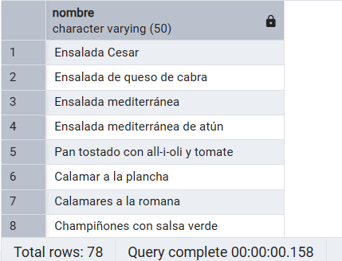

- Devuelve el id y el nombre de los clientes

```SQL
SELECT id, nombre
FROM CLIENTES;
```

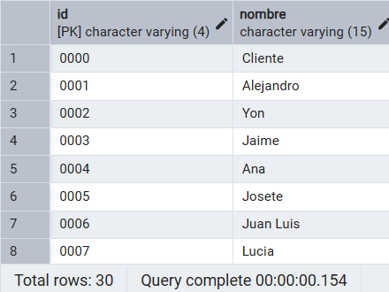

- Devuelve el id de los pedidos realizados los dias 14

```SQL
SELECT id
FROM PEDIDOS
WHERE to_char(hora, 'dd') = '14';
```

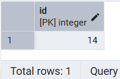

- Devuelve el codigo de los descuentos cual fecha de caducidad sea nula

```SQL
SELECT codigo
FROM DESCUENTOS
WHERE fecha_caducidad IS NULL;
```

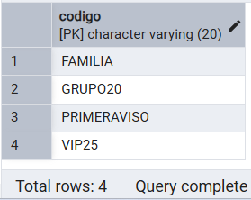

- Devuelve el cif y nombre de los proveedores que esten en una calle

```SQL
SELECT cif, nombre
FROM proveedores
WHERE lower(direccion) LIKE ('c/%');
```

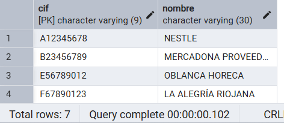

### Actualizaciones y borrados en cualquier tabla

- Actualiza el telefono del cliente con id '0010'

```SQL
UPDATE CLIENTES
SET telefono = '623423197'
WHERE id = '0010';
```

- Actualiza el precio del plato con n_plato '003'

```SQL
UPDATE PLATOS
SET precio = 12.50
WHERE n_plato = '003';
```

- Elimina el cliente con id '0009'

```SQL
DELETE FROM CLIENTES
WHERE id = '0009';
```

- Elimina la reserva con el id 7

```SQL
DELETE FROM RESERVAS
WHERE id = 7;
```

### Consultas con mas de 1 tabla

- Devuelve el nombre de los clientes, el tipo de reserva y la 
fecha de esta

```SQL
SELECT c.nombre, r.tipo_reserva, r.fecha
FROM clientes c, reservas r
WHERE c.id = r.id_cli;
```

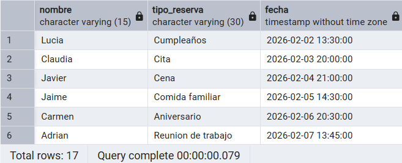

- Devuelve el nombre de los proveedor y el nombre de los ingredientes que suministran

```SQL
SELECT pro.nombre, sus.nombre_ingre
FROM proveedores pro, suministrar sus
WHERE pro.cif = sus.cif_provee;
```

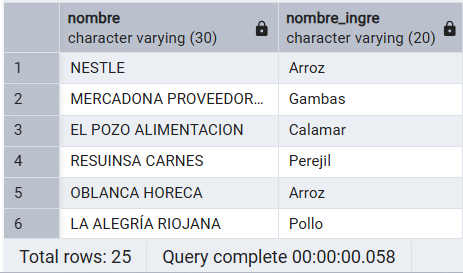

- Muestra el nombre de la zona junto a su bartender

```SQL
SELECT e.nombre, z.nombre
FROM empleados e, zonas z, servir s
WHERE e.dni = s.dni_bartender 
AND s.n_zona = z.n_zona;
```

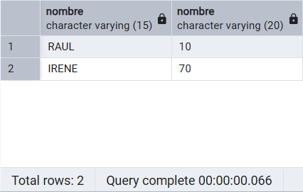

### Consultas usando funciones

- Muestra la cantidad de reservas

```SQL
SELECT count(*) AS cantidad_reservas
FROM RESERVAS;
```

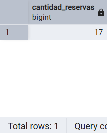

- Muestra la cantidad de platos con el tipo 'arroces'

```SQL
SELECT count(*) AS Arroces
FROM platos
WHERE lower(tipo) LIKE 'arroces%';
```

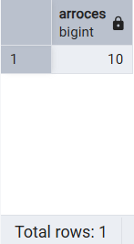

- Suma todas las existencias de los alimentos frescos

```SQL
SELECT SUM(i.existencias) AS Frescos
FROM ingredientes i
WHERE upper(tipo) LIKE 'FRESCOS';
```

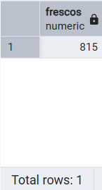

### Consultas usando Group By

- Muestra el nombre del cliente y la cantidad de pedidos totales que ha realizado

```SQL
SELECT cli.nombre, count(p.*) as pedidos_totales
FROM clientes cli, pedidos p, realizar r
WHERE cli.id = r.id_cli AND r.id_pedi = p.id
GROUP BY cli.id, cli.nombre
ORDER BY cli.id;
```

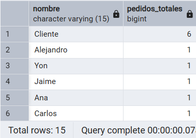

- Muestra el nombre del jefe y la cantidad de empleados que tiene a su supervision

```SQL
SELECT j.nombre, count(o.*) AS Mandados
FROM jefes j, organizar o
WHERE o.dni_jefe = j.dni
GROUP BY j.nombre;
```

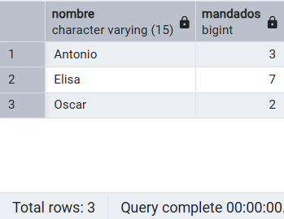

### Consultas usando Subconsultas

- Pedidos que tienen clientes asociados

```SQL
SELECT p.id, p.n_mesa,p.hora
FROM PEDIDOS p
WHERE p.id IN (
    SELECT r.id_pedi
    FROM REALIZAR r
);
```

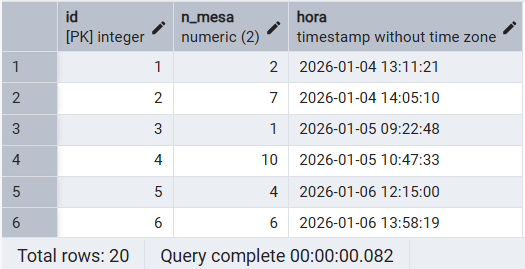

- Clientes que han pedido un plato en concreto

```SQL
SELECT c.id,c.nombre
FROM CLIENTES c
WHERE c.id IN (
    SELECT r.id_cli
    FROM REALIZAR r
    WHERE r.id_pedi IN (
        SELECT t.id_pedido
        FROM TENER t
        WHERE t.n_plato = '001'));
```

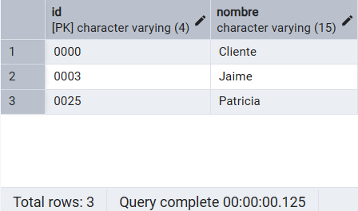

- El cliente que ha realiado mas pedidos

```SQL
SELECT cli.nombre
FROM clientes cli, realizar re
WHERE cli.id = re.id_cli
GROUP BY cli.id
HAVING count(re.*) = (SELECT MAX(t.n)
					FROM (SELECT count(re.*) AS n
					FROM realizar re
					GROUP BY re.id_cli) t);
```

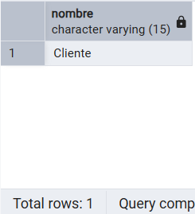

### Consultas con Having

- Clientes con mas de 3 pedidos

```SQL
SELECT r.id_cli, COUNT(*) AS num_pedidos
FROM REALIZAR r
GROUP BY r.id_cli
HAVING COUNT(*) > 3;
```

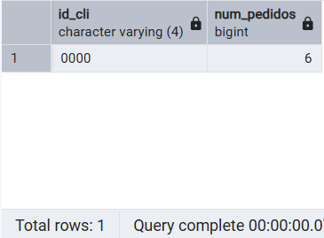

- Mesas con mas pedidos que la media

```SQL
SELECT p.n_mesa, COUNT(*) AS num_pedidos
FROM PEDIDOS p
GROUP BY p.n_mesa
HAVING COUNT(*) >= (SELECT AVG(cnt_pedidos)FROM (
    SELECT n_mesa, COUNT(*) AS cnt_pedidos
    FROM PEDIDOS
    GROUP BY n_mesa));
```

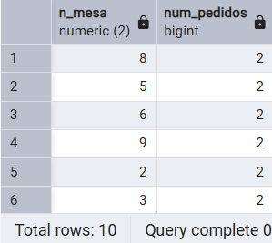

### Actualizaciones usando subconsultas en Where y Set

- Pon el precio de los platos al precio medio de los precios de los proveedores

```SQL
UPDATE PLATOS p
SET precio = (
    SELECT AVG(precio)
    FROM SUMINISTRAR S
    WHERE s.n_plato = p.n_plato
);
```

- Actualiza el colectivo de empleados que sean cocineros

```SQL
UPDATE EMPLEADOS
SET colectivo = 'COCINA'
WHERE dni IN (
    SELECT dni_empleado
    FROM COCINERO
);
```

- Actualiza el campo 'n_personas' de una mesa al máximo de personas que aparecen en reservas.

```SQL
UPDATE MESAS
SET n_personas = (
    SELECT MAX(n_personas)
    FROM RESERVAS
);
```