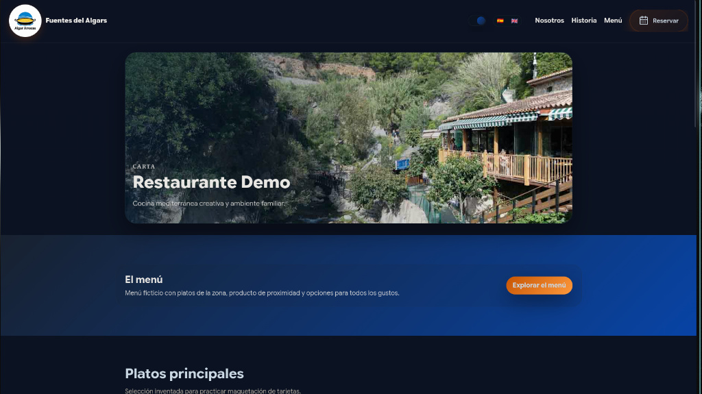
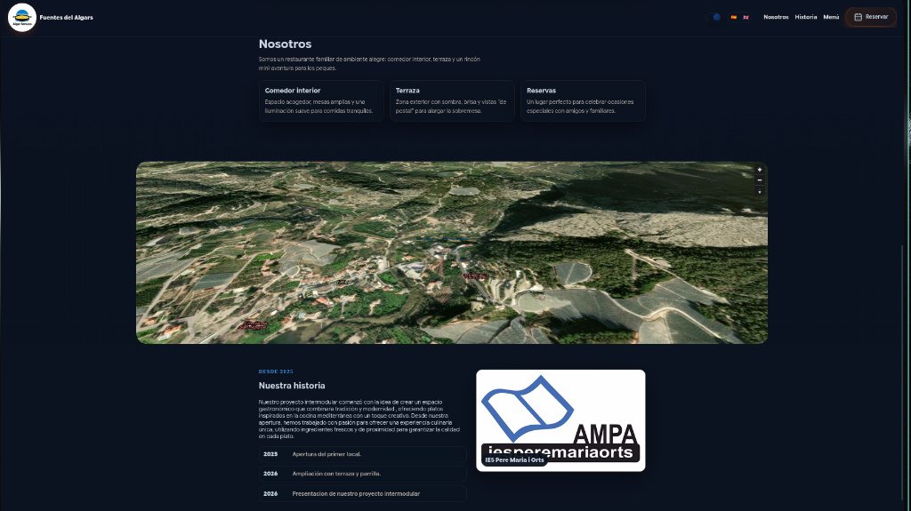
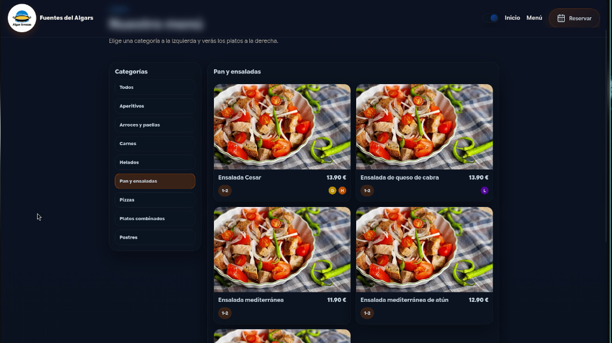
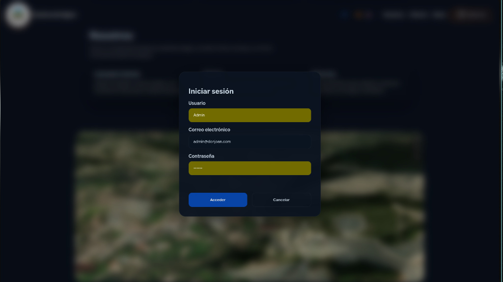
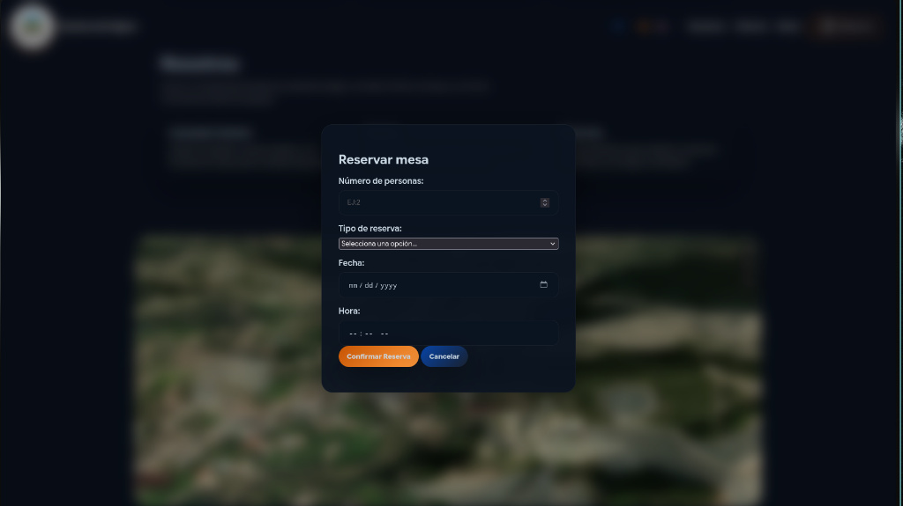

# Memoria Proyecto Intermodular: Frontend y UI

---

## Metadatos

- **Autor:** Jaime Pérez, Óscar Berenguer, Alejandro Robledillo
- **Fecha:** 17/02/2026
- **Versión:** V1.0
- **Curso:** Desarrollo de Aplicaciones Multiplataforma
- **Asignatura:** Entornos de Desarrollo / Desarrollo Web / Bases de Datos

---

## Índice

- [Memoria Proyecto Intermodular: Frontend y UI](#memoria-proyecto-intermodular-frontend-y-ui)
  - [Metadatos](#metadatos)
  - [Índice](#índice)
  - [1. Idea del Proyecto](#1-idea-del-proyecto)
  - [2. Diseño e Ideas Aplicadas](#2-diseño-e-ideas-aplicadas)
  - [3. Problemas Encontrados](#3-problemas-encontrados)
  - [4. Soluciones Implementadas](#4-soluciones-implementadas)
  - [5. Conexión con la Base de Datos (Backend)](#5-conexión-con-la-base-de-datos-backend)
  - [6. Análisis de la Interfaz y Experiencia de Usuario (UI/UX)](#6-análisis-de-la-interfaz-y-experiencia-de-usuario-uiux)
    - [6.1. Pantalla Principal y Navegación (Landing Page)](#61-pantalla-principal-y-navegación-landing-page)
    - [6.2. Sección "Nosotros" y Mapa Interactivo](#62-sección-nosotros-y-mapa-interactivo)
    - [6.3. Carta Digital (Página de Menú)](#63-carta-digital-página-de-menú)
    - [6.4. Formularios Modales (Inicio de Sesión y Reservas)](#64-formularios-modales-inicio-de-sesión-y-reservas)

---

## 1. Idea del Proyecto

El proyecto consiste en el desarrollo de una aplicación web completa para la gestión de un restaurante ficticio ("Restaurante Demo" / "Fuentes del Algar"). Esta *landing page* sirve como el frontal de nuestro **Proyecto Intermodular**, uniendo los conocimientos de maquetación web (HTML/CSS), lógica de cliente (JavaScript) y el diseño de Bases de Datos Relacionales (SQL).

El objetivo principal es ofrecer una experiencia de usuario moderna, intuitiva y responsive, que permita a los clientes consultar la carta digital interactiva, conocer la historia del local, visualizar la ubicación mediante un mapa interactivo, iniciar sesión y realizar reservas de mesas de forma cómoda.

---

## 2. Diseño e Ideas Aplicadas

Para el desarrollo del frontal, hemos aplicado diversas ideas y tecnologías con el fin de crear una interfaz profesional:

* **Modo Oscuro (Dark Theme):** Se ha optado por una paleta de colores oscuros con acentos en azul y naranja para los botones principales (CTAs). Esto aporta elegancia, reduce la fatiga visual y hace resaltar las fotografías de los platos.
* **Sistema Multilingüe Dinámico:** Hemos implementado un sistema de internacionalización propio utilizando JavaScript y atributos de datos (`data-lang`). Esto permite al usuario alternar entre Español e Inglés sin tener que recargar la página, leyendo la información de un objeto JSON estructurado.
* **Menú Interactivo y Filtrable:** Se ha desarrollado un script que renderiza dinámicamente las tarjetas de los platos a partir de un array de datos (conectado a la Base de Datos). Incluye un sistema de filtrado por categorías y la muestra de iconos dinámicos de alérgenos.
* **Modales Superpuestos:** Para funciones clave como el **Inicio de Sesión** y la **Reserva de Mesas**, se han diseñado ventanas modales que se superponen al contenido principal, incluyendo desplegables dinámicos para elegir el tipo de reserva.
* **Mapa Interactivo:** Se ha integrado la librería *MapLibre GL* para mostrar una vista satelital interactiva del entorno del restaurante, ofreciendo a los clientes una idea clara del entorno físico.

---

## 3. Problemas Encontrados

Durante la fase de desarrollo e integración de los scripts, nos encontramos con varios obstáculos técnicos reflejados en el depurador del navegador:

1. **Conflictos con elementos nulos (Null Reference Errors):** Al compartir el archivo de JavaScript entre varias páginas HTML, el script fallaba al intentar añadir un evento a botones que no existían en esa vista específica. Esto "congelaba" la ejecución del resto del código.
2. **Carga de dependencias externas:** La consola mostraba errores indicando que el objeto del mapa no existía (`MapLibreGL is not defined`), lo que ocurría porque nuestro script intentaba inicializar el mapa antes de que la librería externa terminara de descargarse, o porque faltaba la etiqueta en ciertas páginas.
3. **Caché del Navegador:** Los navegadores no actualizaban el CSS ni el icono de la pestaña al hacer cambios, e incluso mostraban datos JSON antiguos de arrays anteriores.

---

## 4. Soluciones Implementadas

Para solventar los problemas descritos anteriormente, aplicamos las siguientes correcciones en nuestro código:

* **Protección del DOM en JavaScript:** Modificamos la lógica para comprobar primero si un elemento existe en el HTML antes de intentar interactuar con él, guardando los elementos en variables y usando condicionales IF (ej. `if (btnEs) { ... }`).
* **Orden de carga de Scripts:** Ajustamos el HTML asegurándonos de que las etiquetas de librerías de terceros estuvieran declaradas e importadas correctamente en el `<head>` de todas las páginas necesarias.
* **Busting de Caché:** Añadimos un parámetro de versión en etiquetas como el favicon (añadiendo `?v=1`) para forzar a los navegadores a descargar la imagen más reciente, y utilizamos limpiezas de caché manuales desde la pestaña de Red.

---

## 5. Conexión con la Base de Datos (Backend)

Todo este frontal ha sido diseñado teniendo en cuenta el **Modelo Lógico** y el **DDL** desarrollado previamente. Las interfaces creadas se corresponden directamente con las tablas de la base de datos relacional en PostgreSQL:

* El formulario de **Reservas** envía datos formateados y tipados para alimentar la tabla `RESERVAS (id, n_personas, tipo_reserva, fecha, id_cli)`.
* El modal de **Inicio de Sesión** está estructurado para cruzar credenciales con la tabla `USUARIOS (id_usuario, email, password, rol, id_cliente, dni_empleado)`.
* Las tarjetas de platos de la carta digital reflejan y consumen los datos extraídos de la tabla `PLATOS (n_plato, nombre, precio, tipo)`.
* El sistema de iconos de **Alérgenos** aprovecha el cruce avanzado de datos entre las tablas `PLATOS`, `SUMINISTRAR`, `CONTIENE` y `ALERGENOS`.

---

## 6. Análisis de la Interfaz y Experiencia de Usuario (UI/UX)

En este apartado se detallan las distintas pantallas desarrolladas, explicando la estructura visual, la funcionalidad de cada elemento y las acciones que el usuario puede realizar.

### 6.1. Pantalla Principal y Navegación (Landing Page)

* **Estructura y Por qué:** La pantalla principal está dividida en un encabezado fijo de navegación (Navbar) y una gran tarjeta hero (Hero Section) con una imagen del entorno. Se estructura así para captar la atención inmediatamente con la fotografía del lugar, mientras se mantienen siempre accesibles las opciones de navegación.
* **Funcionalidades y Acciones del Usuario:**
  * **Menú Superior:** El usuario puede navegar a las secciones "Nosotros", "Historia" y "Menú" haciendo clic en los enlaces.
  * **Botón de Reservar:** Al hacer clic, despliega el modal de reservas.
  * **Selector de Idiomas:** Mediante los iconos de las banderas (Español/Inglés) o el *toggle* (interruptor), el usuario puede cambiar todo el texto de la página dinámicamente sin necesidad de recargar.
  * **Botón CTA (Call to Action):** El botón naranja "Explorar el menú" baja automáticamente la pantalla hasta la sección de los platos principales.

### 6.2. Sección "Nosotros" y Mapa Interactivo

* **Estructura y Por qué:** Esta sección combina tarjetas descriptivas de texto con un elemento visual potente (el mapa). Las tarjetas (Comedor Interior, Terraza, Reservas) están diseñadas en un formato horizontal limpio para explicar los espacios, y justo debajo se ubica el mapa a pantalla completa. Esto ayuda al usuario a situarse geográficamente tras conocer las instalaciones.
* **Funcionalidades y Acciones del Usuario:**
  * **Tarjetas Informativas:** El usuario puede leer los detalles de las zonas del restaurante, lo que corresponde lógicamente con la tabla `ZONAS` de nuestra base de datos.
  * **Mapa Interactivo (MapLibre):** El usuario puede hacer zoom (`+` y `-`), arrastrar para moverse por el terreno satelital y ver la ubicación exacta del local en relación con su entorno.

### 6.3. Carta Digital (Página de Menú)

* **Estructura y Por qué:** Se ha optado por un diseño de "panel dividido". A la izquierda hay una columna fija con las categorías (Aperitivos, Arroces, Carnes, etc.) y a la derecha se despliega el listado de tarjetas de los platos correspondientes. Esta estructura evita que el usuario tenga que hacer un *scroll* infinito si hay muchos platos, permitiendo una búsqueda rápida y enfocada.
* **Funcionalidades y Acciones del Usuario:**
  * **Filtrado por Categorías:** El usuario puede hacer clic en cualquier botón de la barra lateral (ej. "Pan y ensaladas") y las tarjetas de la derecha cambiarán instantáneamente para mostrar solo los platos de ese grupo (conectado con el campo `tipo` de la tabla `PLATOS`).
  * **Visualización de Alérgenos:** En cada tarjeta, el usuario puede ver los alérgenos que contiene el plato representados por pequeños círculos de colores con iniciales (G, H, L, etc.). Al pasar el ratón por encima (hover), aparece un pequeño globo de texto indicando el nombre completo del alérgeno.
  * **Información del Plato:** Se muestra el nombre, el precio y el número de personas recomendado para cada ración.

### 6.4. Formularios Modales (Inicio de Sesión y Reservas)

* **Estructura y Por qué:** Tanto el inicio de sesión como la reserva de mesas se abren como "ventanas flotantes" (Modales) sobre un fondo oscuro desenfocado. Se utiliza este formato para no sacar al usuario de la página en la que se encuentra y obligarle a enfocar su atención únicamente en completar el formulario.
* **Funcionalidades y Acciones del Usuario:**
  * **Modal de Inicio de Sesión:** Permite a los usuarios o empleados (según la tabla `USUARIOS`) introducir su correo electrónico y contraseña. El campo de correo recuerda automáticamente el último usuario introducido gracias al `localStorage`.
  * **Modal de Reservar Mesa:** Permite al usuario configurar los detalles de su visita. Incluye un selector numérico (Personas), un menú desplegable nativo (Tipo de reserva), y selectores de fecha y hora. Todos estos datos están preparados para ser insertados en la tabla `RESERVAS` de la base de datos tras verificar la autenticación del usuario.
  * **Botones de Cancelar:** Ambos modales permiten al usuario retroceder o cerrar la ventana pulsando fuera de ella o haciendo clic en el botón de cancelar.

