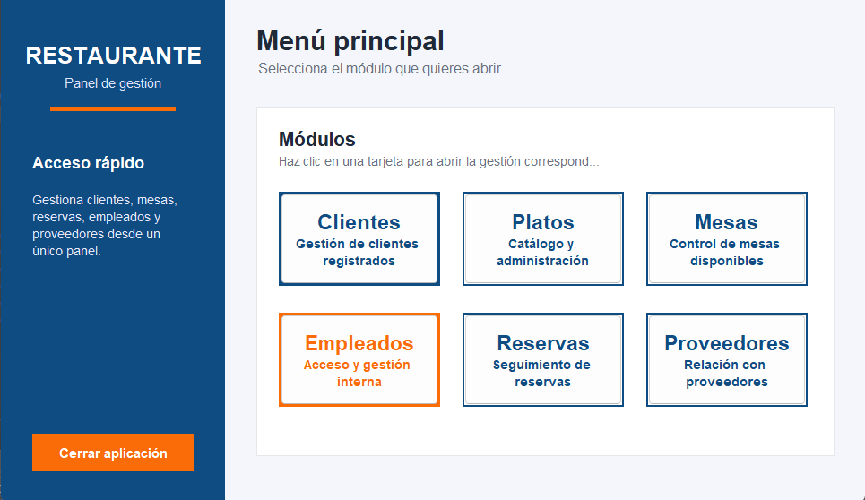
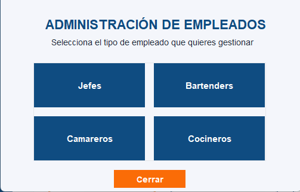
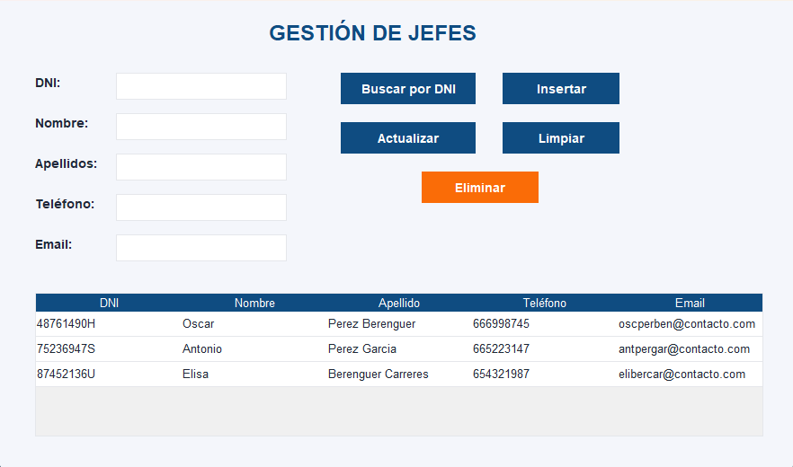
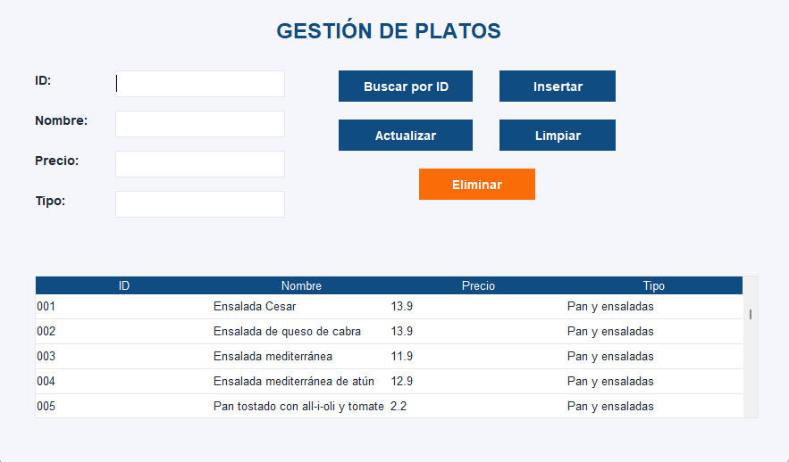
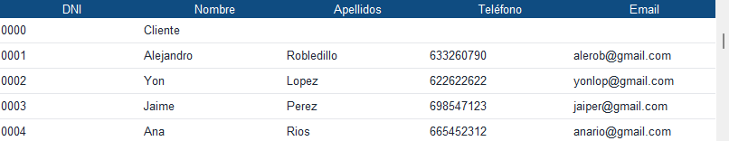
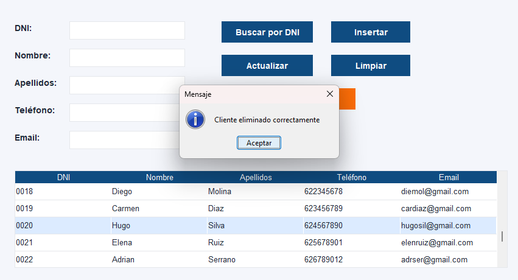

# Memoria de la parte gráfica

## Desarrollo de la interfaz gráfica

La parte gráfica del proyecto se ha desarrollado utilizando **Java Swing**, empleando clases y componentes como `JFrame`, `JPanel`, `JLabel`, `JButton`, `JTextField`, `JScrollPane`, `JTable` y `DefaultTableModel`. La aplicación se ha planteado como un programa de escritorio dividido en varias ventanas, cada una de ellas orientada a una parte concreta de la gestión del restaurante.

Para la construcción de las distintas pantallas se ha utilizado una estructura basada en ventanas independientes que heredan de `JFrame`, como por ejemplo `VentanaPrincipal`, `VentanaPrincipalJefe`, `VentanaGJefes`, `VentanaBartender`, `VentanaCamareros` y `VentanaCocineros`. De esta forma, cada módulo queda separado del resto, pero manteniendo una misma línea visual y una navegación sencilla entre pantallas.

## Componentes utilizados

En el diseño de las interfaces se han utilizado componentes estándar de Swing como `JLabel` para mostrar textos, `JTextField` para la introducción de datos, `JButton` para ejecutar acciones y `JTable` para representar la información de manera estructurada. Además, se ha empleado `DefaultTableModel` para gestionar el contenido de las tablas de forma dinámica, permitiendo insertar, actualizar, eliminar y volver a cargar registros.

También se han utilizado clases auxiliares como `EmptyBorder`, `BorderFactory`, `Font`, `Color`, `Cursor`, `GridLayout`, `JTableHeader` y `DefaultTableCellRenderer`, con el objetivo de mejorar la presentación visual de la aplicación y mantener una apariencia más uniforme en todas las ventanas.

## Diseño visual

A nivel estético, se ha buscado una interfaz sencilla pero más moderna que la predeterminada de Swing. Para ello se ha definido una paleta de colores personalizada, destacando principalmente el azul `#0f4c81` como color principal y el naranja `#fa6c07` como color secundario para acciones destacadas, como por ejemplo botones de cierre o eliminación.

Los botones se han personalizado mediante métodos como `setBackground(...)`, `setForeground(...)`, `setFont(...)`, `setBorderPainted(false)`, `setFocusPainted(false)` y `setCursor(...)`, consiguiendo un aspecto más limpio y homogéneo. Del mismo modo, se han ajustado los colores de fondo de paneles y tablas para mantener una presentación clara y agradable para el usuario.

## Organización de las ventanas

Las ventanas de gestión siguen una estructura común. En la parte superior o lateral se sitúan los campos de entrada de datos, en una zona visible aparecen los botones de acción principales y en la parte inferior se coloca una tabla `JTable` con los registros almacenados. Esta organización facilita el uso del programa, ya que el usuario se acostumbra rápidamente al funcionamiento de cada pantalla.

En algunas ventanas también se ha empleado `GridLayout` para organizar botones de acceso directo, como ocurre en la ventana de administración de empleados. Esto permite repartir los botones de forma uniforme y mantener una distribución equilibrada.

## Uso de tablas

Uno de los aspectos más importantes de la parte gráfica ha sido la utilización de `JTable` para mostrar la información. En lugar de presentar los datos únicamente en cuadros de texto o áreas de texto, se ha optado por trabajar con tablas porque ofrecen una visualización más clara, más ordenada y más cercana a una aplicación real de gestión.

Las tablas se han integrado dentro de un `JScrollPane`, permitiendo la navegación cuando el contenido es más amplio. Además, se ha personalizado la cabecera de algunas tablas con `JTableHeader` y `DefaultTableCellRenderer`, aplicando colores corporativos para mejorar la apariencia general de la interfaz.

## Eventos y funcionamiento

La interacción con la interfaz se ha implementado mediante `ActionListener` en los botones, en muchos casos usando expresiones lambda para simplificar el código. Gracias a esto, cada botón puede realizar acciones concretas como abrir nuevas ventanas, buscar un registro por DNI, insertar datos, actualizar información existente, eliminar registros o limpiar los campos del formulario.

Esta organización permite que la interfaz no solo tenga una función visual, sino también operativa, conectándose correctamente con la lógica del programa y con las clases DAO encargadas del acceso a datos.

## Valoración final de la parte gráfica

La parte gráfica del proyecto se ha construido buscando equilibrio entre funcionalidad, claridad y estética. Aunque se ha trabajado con componentes clásicos de Java Swing, se ha intentado mejorar su apariencia mediante personalización de colores, fuentes, bordes y distribución de elementos.

Como resultado, se ha obtenido una interfaz coherente en todas las ventanas, visualmente más cuidada y adecuada para una aplicación de gestión de restaurante. Además, el uso de clases como `JFrame`, `JPanel`, `JButton`, `JTextField`, `JTable`, `DefaultTableModel` y `ActionListener` ha permitido desarrollar una aplicación completa utilizando contenidos propios del módulo de programación.